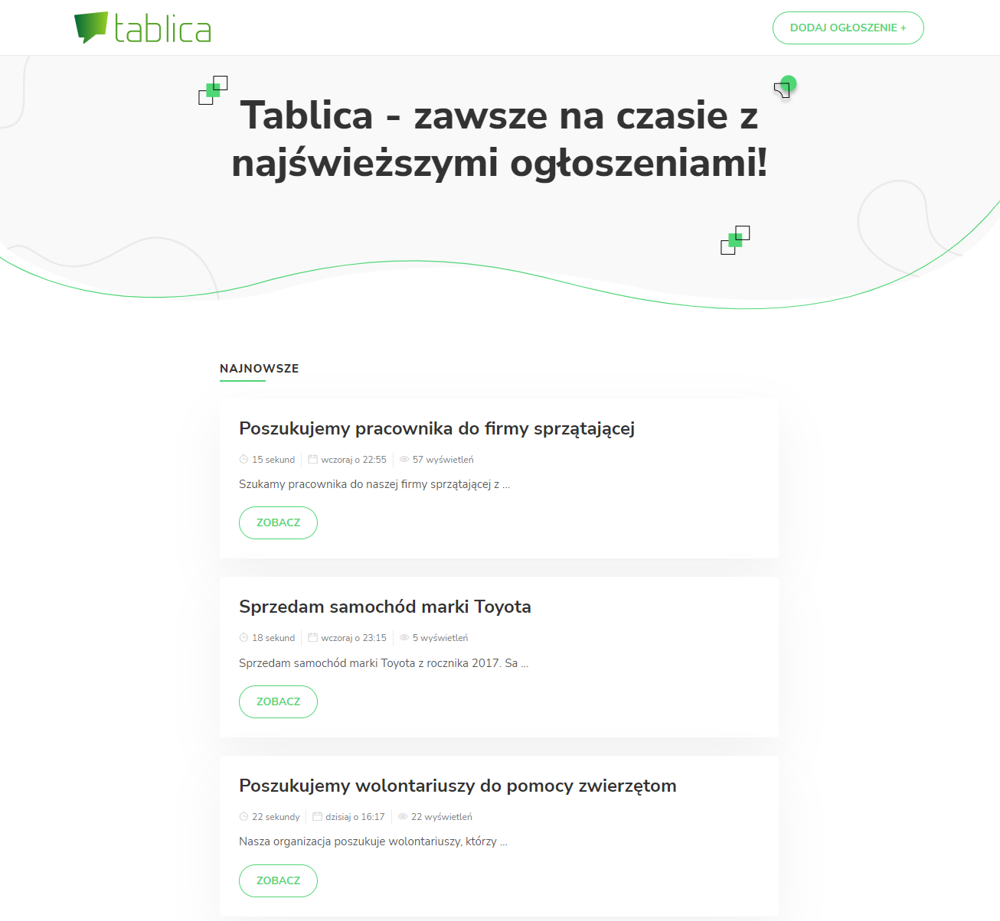
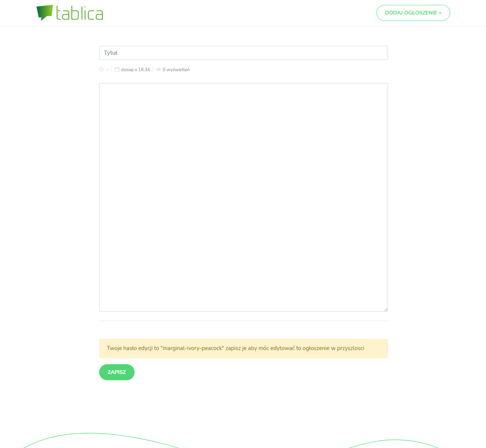
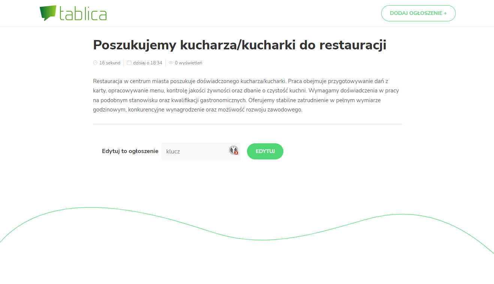

# Market

[Edit on StackBlitz ⚡️](https://stackblitz.com/edit/tablica-ogloszen)

Prosty system ogłoszeń bez rejestracji
Wchodząc na stronę główną widzimy wszystkie ogłoszenia z możliwością filtrowania po kategorii
Klikając dodaj tworzymy nowe ogłoszenie, ogłoszenie posiada swój unikatowy adres oraz kod edycji.
Kod edycji umożliwia nam po wejściu na ogłoszenie jego edycje.
Nie istnieje nic takiego jak użytkownik, wszystkie ogłoszenia sa anonimowe.

## Uruchomienie produkcyjne

```bash
npm i
npm run build
npm run start
```

## Uruchomienie produkcyjne

```bash
npm i
npm run dev
```

## Struktura

### widoki

- home `/` - strona głowna, z widokiem wszystkich ogłoszeń
- ogloszenie `/notice/:id` - widok pojedyńczego ogłszenia
- add `/notice/add` - tworzenie ogłoszenia
- edit `/notice/:id/edit` - edycja ogłoszenia

### modele

```typescript
type UUID = string

type Markdown = string

interface Notice {
    id: UUID
    editKey: string
    title: string
    date: Date
    body: Markdown
    active: boolean
}
```

### kontrolery

**database** kontroler odpowiedzialny za połączenie z bazą danych, oraz posiadajacy api do zadządania nią

**notice** kontroler odpowiedzialny za zadzadanie ogłoszeniami

### screen shots




